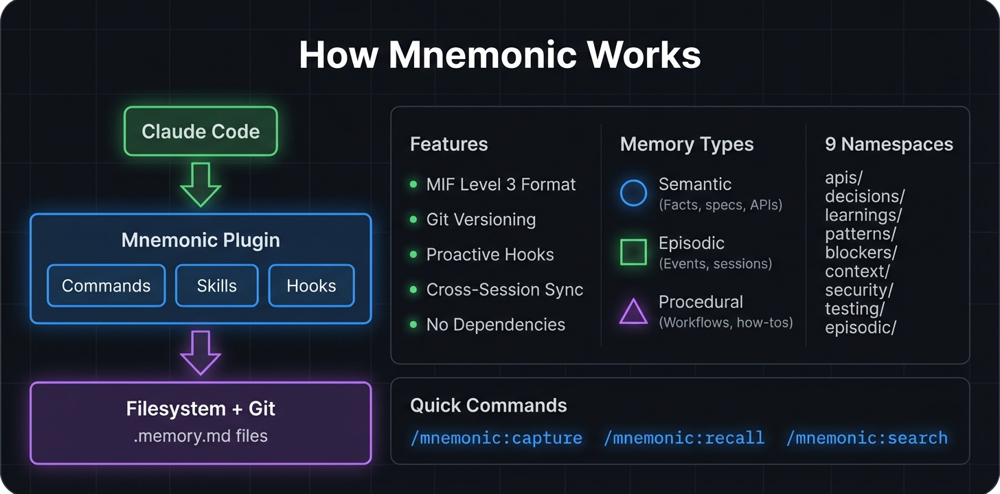

# Mnemonic

[](https://opensource.org/licenses/MIT)
[](https://docs.anthropic.com/en/docs/claude-code)
[](https://github.com/zircote/MIF)
[](https://www.letta.com/blog/benchmarking-ai-agent-memory)

**Supported Coding Assistants:**

[](docs/integrations/README.md)
[](docs/integrations/github-copilot.md)
[](docs/integrations/cursor.md)
[](docs/integrations/windsurf.md)
[](docs/integrations/aider.md)
[](docs/integrations/continue.md)
[](docs/integrations/codex-cli.md)
[](docs/integrations/gemini-cli.md)
[](docs/integrations/opencode.md)

A pure filesystem-based memory system for Claude Code. No external dependencies - all operations use standard Unix tools and Claude's native capabilities.

<p align="center">
  
</p>

> **Note**: This plugin implements the [Memory Interchange Format (MIF)](https://github.com/zircote/MIF) specification for standardized AI memory storage and interchange. MIF defines a portable, human-readable format for persistent AI memories across different systems and agents.

## Features

- **Pure Filesystem**: All memories stored as markdown files with YAML frontmatter
- **MIF Level 3 Compliant**: Standardized Memory Interchange Format
- **Skill-First Architecture**: Skills work standalone without hooks or libraries
- **Cognitive Memory Types**: Semantic, episodic, and procedural memories
- **Bi-Temporal Tracking**: Valid time vs. recorded time
- **Git Versioned**: All changes tracked with git
- **Cross-Session Coordination**: Blackboard for session handoffs

## Why Filesystem?

Research validates the filesystem approach for AI memory. In [Letta's LoCoMo benchmark](https://www.letta.com/blog/benchmarking-ai-agent-memory), filesystem-based memory achieved **74.0% accuracy** compared to Mem0's graph-based approach at **68.5%**. This counterintuitive result has a simple explanation: LLMs are extensively pretrained on filesystem operations, making simple tools more reliable than specialized knowledge graphs or vector databases.

This approach is grounded in Unix philosophy, as articulated in ["From Everything is a File to Files Are All You Need"](https://arxiv.org/abs/2601.11672). Just as Unix collapsed diverse device interfaces into uniform file operations, AI agents benefit from the same abstraction—complexity is encapsulated, not eliminated.

**Key advantages of the filesystem approach:**
- LLMs already understand `grep`, `find`, and file operations from training data
- Human-readable format enables direct inspection and editing
- Git integration provides full version history with meaningful diffs
- No external services, databases, or cloud dependencies
- Works offline and respects data sovereignty

## Installation

```bash
# Load the plugin
claude --plugin-dir /path/to/mnemonic

# Or add to settings for permanent installation
claude settings plugins add /path/to/mnemonic
```

## Quick Start

```bash
# Initialize mnemonic for your project
/mnemonic:setup

# Capture a memory
/mnemonic:capture decisions "Use PostgreSQL for storage" --tags database,architecture

# Recall memories
/mnemonic:recall --namespace decisions

# Search memories
/mnemonic:search "authentication"

# Check status
/mnemonic:status
```

## Directory Structure

**User-level** (`~/.claude/mnemonic/{org}/`):
```
~/.claude/mnemonic/{org}/
├── apis/user/           # API documentation
├── blockers/user/       # Issues, impediments
├── context/user/        # Background information
├── decisions/user/      # Architectural choices
├── learnings/user/      # Insights, discoveries
├── patterns/user/       # Code conventions
├── security/user/       # Security policies
├── testing/user/        # Test strategies
├── episodic/user/       # Events, experiences
└── .blackboard/         # Cross-session coordination
```

**Project-level** (`./.claude/mnemonic/`):
```
./.claude/mnemonic/
├── apis/project/
├── blockers/project/
├── decisions/project/
├── learnings/project/
├── patterns/project/
├── security/project/
├── testing/project/
├── episodic/project/
└── .blackboard/
```

## Memory Format (MIF Level 3)

Mnemonic implements the [Memory Interchange Format (MIF)](https://github.com/zircote/MIF) specification. MIF is a proposed standard for portable, human-readable AI memory storage that enables:

- **Interoperability**: Memories can be shared between different AI systems
- **Human Readability**: Plain markdown with YAML frontmatter
- **Version Control**: Git-friendly format with clear diffs
- **Temporal Awareness**: Bi-temporal tracking (valid time vs recorded time)
- **Decay Modeling**: Configurable relevance decay over time
- **Citations**: Optional external references (papers, docs, blogs)

Each memory is a `.memory.md` file:

```yaml
---
id: 550e8400-e29b-41d4-a716-446655440000
type: semantic
namespace: decisions/project
created: 2026-01-23T10:30:00Z
modified: 2026-01-23T14:22:00Z
title: "Use PostgreSQL for storage"
tags:
  - database
  - architecture
temporal:
  valid_from: 2026-01-23T00:00:00Z
  recorded_at: 2026-01-23T10:30:00Z
  decay:
    model: exponential
    half_life: P7D
    strength: 0.85
provenance:
  source_type: conversation
  agent: claude-opus-4
  confidence: 0.95
citations:
  - type: documentation
    title: "PostgreSQL Documentation"
    url: https://www.postgresql.org/docs/
    relevance: 0.90
---

# Use PostgreSQL for Storage

We decided to use PostgreSQL for our data storage needs.

## Rationale
- Strong ACID compliance
- Excellent JSON support
- Mature ecosystem
```

## Memory Types

| Type | Use Case | Examples |
|------|----------|----------|
| **semantic** | Facts, concepts, specifications | API docs, config values |
| **episodic** | Events, experiences, incidents | Debug sessions, deployments |
| **procedural** | Processes, workflows, how-tos | Deployment steps, runbooks |

## Namespaces

| Namespace | Purpose |
|-----------|---------|
| `apis/` | API documentation, contracts |
| `blockers/` | Issues, impediments, incidents |
| `context/` | Background information, state |
| `decisions/` | Architectural choices, rationale |
| `learnings/` | Insights, discoveries, TILs |
| `patterns/` | Code conventions, best practices |
| `security/` | Security policies, vulnerabilities |
| `testing/` | Test strategies, edge cases |
| `episodic/` | General events, experiences |

## Commands

| Command | Description |
|---------|-------------|
| `/mnemonic:setup` | Configure mnemonic with proactive behavior |
| `/mnemonic:init` | Initialize directory structure |
| `/mnemonic:capture` | Capture a new memory |
| `/mnemonic:recall` | Search and recall memories |
| `/mnemonic:search` | Full-text search |
| `/mnemonic:search-enhanced` | Agent-driven iterative search with synthesis |
| `/mnemonic:status` | Show system status |
| `/mnemonic:gc` | Garbage collect expired memories |

## Skills

Skills are fully self-contained and work without hooks or libraries:

- **mnemonic-setup**: Configure CLAUDE.md for proactive behavior
- **mnemonic-core**: Complete memory operations
- **mnemonic-search**: Advanced search patterns
- **mnemonic-search-enhanced**: Agent-driven iterative search with synthesis
- **mnemonic-format**: MIF Level 3 templates
- **mnemonic-organization**: Namespaces and maintenance
- **mnemonic-blackboard**: Cross-session coordination

## Agents

Autonomous agents for specialized tasks:

- **memory-curator**: Conflict detection, deduplication, decay management
- **mnemonic-search-subcall**: Efficient search agent for iterative query refinement

## Integrations

Mnemonic works with multiple AI coding assistants beyond Claude Code:

| Tool | Integration | Guide |
|------|-------------|-------|
| GitHub Copilot | `.github/copilot-instructions.md` | [Guide](docs/integrations/github-copilot.md) |
| Cursor | `.cursor/rules/mnemonic.mdc` | [Guide](docs/integrations/cursor.md) |
| Aider | `CONVENTIONS.md` | [Guide](docs/integrations/aider.md) |
| Continue Dev | `config.yaml` rules | [Guide](docs/integrations/continue.md) |
| Codex CLI | `AGENTS.md` + Skills | [Guide](docs/integrations/codex-cli.md) |
| Gemini CLI | MCP Server | [Guide](docs/integrations/gemini-cli.md) |
| Windsurf | Memories/Rules | [Guide](docs/integrations/windsurf.md) |
| OpenCode | Skills | [Guide](docs/integrations/opencode.md) |

See [docs/integrations/](docs/integrations/) for setup guides and templates.

## Proactive Behavior

After running `/mnemonic:setup`, Claude will:

1. **Auto-Recall**: Silently search for relevant memories when you discuss topics
2. **Auto-Capture**: Automatically save decisions, learnings, and patterns
3. **Silent Operation**: Memory operations happen in the background

## Search Examples

```bash
# Full-text search
rg -i "authentication" ~/.claude/mnemonic/ --glob "*.memory.md"

# By namespace
rg "pattern" ~/.claude/mnemonic/*/decisions/ --glob "*.memory.md"

# By tag
rg -l "^  - security" ~/.claude/mnemonic/ --glob "*.memory.md"

# By type
rg "^type: episodic" ~/.claude/mnemonic/ --glob "*.memory.md" -l

# Recent files (last 7 days)
find ~/.claude/mnemonic -name "*.memory.md" -mtime -7
```

## Hooks

Hooks provide proactive automation:

| Event | Purpose |
|-------|---------|
| SessionStart | Load relevant memories |
| UserPromptSubmit | Inject context, detect capture opportunities |
| PostToolUse | Capture learnings from tool results |
| Stop | Commit changes, summarize session |

## Blackboard

The blackboard enables cross-session coordination:

```bash
# Write to blackboard
echo "## Task started" >> ~/.claude/mnemonic/.blackboard/active-tasks.md

# Read recent entries
tail -50 ~/.claude/mnemonic/.blackboard/session-notes.md
```

## Git Versioning

All memories are versioned with git:

```bash
cd ~/.claude/mnemonic
git log --oneline -20
git show HEAD~3:path/to/memory.memory.md
```

## Development

```bash
# Project structure
mnemonic/
├── .claude-plugin/
│   └── plugin.json         # Plugin manifest
├── agents/
│   └── memory-curator.md   # Maintenance agent
├── commands/
│   └── *.md                # Slash commands
├── docs/
│   ├── architecture.md     # System architecture
│   ├── contributing.md     # Contribution guide
│   └── integrations/       # Multi-tool integration guides
│       └── *.md
├── hooks/
│   ├── hooks.json          # Hook configuration
│   └── *.py                # Hook implementations
├── skills/
│   └── */SKILL.md          # Self-contained skills
├── templates/              # Integration templates
│   ├── AGENTS.md           # Universal agent instructions
│   ├── CONVENTIONS.md      # Aider conventions
│   ├── copilot-instructions.md
│   └── cursor-rule.mdc
├── CHANGELOG.md
└── README.md
```

## Requirements

- Claude Code CLI
- Git
- ripgrep (recommended)
- Python 3.8+ (for hooks)

## Related Projects

- **[MIF (Memory Interchange Format)](https://github.com/zircote/MIF)** - The specification this plugin implements. A proposed standard for portable AI memory storage.

## License

MIT
