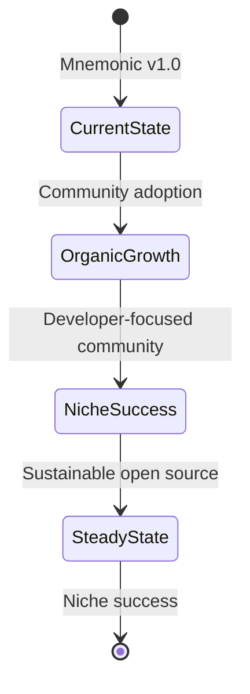

# AI Memory Systems with Filesystem-Based Interfaces

**Research Date**: 2026-01-24
**Last Updated**: 2026-01-24T12:30:00Z
**Status**: Complete
**Researcher**: sigint market research agent

---

## Change Log

### 2026-01-24T13:00:00Z - Strategic Decision: MCP Out of Scope

**Project decision**: MCP integration is explicitly out of scope for mnemonic. The project will pursue organic growth through:
- Strong documentation and integration guides
- Community engagement with Memory Bank users
- Direct tool-specific integrations (Cursor rules, Windsurf rules, etc.)
- Enterprise positioning around data sovereignty and simplicity

This aligns with mnemonic's core philosophy of zero external dependencies.

### 2026-01-24T12:30:00Z - January 2026 Market Update

**Significant developments since initial research:**

- **MCP adoption accelerated**: Now under Linux Foundation AAIF with 97M monthly SDK downloads
- **GitHub Copilot agentic memory public preview** (Jan 15, 2026): Cross-agent memory sharing with 7% PR merge rate improvement, 28-day auto-expiry, citation-based validation
- **Industry consensus**: VentureBeats 2026 predictions identify agentic memory as "table stakes" for AI assistants

**Impact on mnemonic strategy**: GitHub Copilot's public preview validates mnemonic's citation-based approach. Focus remains on filesystem simplicity and tool-agnostic design.

---

## Research Brief Alignment

This research addresses the decision context of **academic validation, strategic planning, and feature roadmap for mnemonic**. The findings are structured for a technical audience across product, engineering, and open-source community stakeholders who understand filesystem-based storage, YAML frontmatter, and POSIX tool ecosystems.

---

## Executive Summary

### Top 5 Findings (Priority-Ranked)

1. **Filesystem approaches outperform specialized tools**: Letta's LoCoMo benchmark demonstrates that filesystem-based memory achieves 74.0% accuracy compared to Mem0's graph-based approach at 68.5%. This validates mnemonic's core architectural decision.

2. **Unix philosophy is academically validated for AI**: A recent arxiv paper explicitly connects Unix's "everything is a file" principle to modern agentic AI design, providing theoretical backing for mnemonic's approach.

3. **Market gap in simple, private memory**: While MCP-based solutions grow in complexity, mnemonic occupies a unique position: zero dependencies, full data sovereignty, human-readable format. This differentiation strengthens as alternatives become more complex.

4. **Market gap exists in AI coding assistants**: Both Cursor and Windsurf lack native persistent memory; community workarounds using markdown files validate mnemonic's approach and represent adoption opportunity.

5. **Cognitive memory types are becoming standard**: Semantic, episodic, and procedural memory classification from cognitive science is being directly applied in AI agent architectures, validating mnemonic's memory type taxonomy.

### Success Criteria Assessment

| Criterion | Status | Evidence |
|-----------|--------|----------|
| Academic backing for approach | ACHIEVED | Letta benchmark, arxiv Unix philosophy paper |
| Differentiation clarity | ACHIEVED | Simplicity as feature, git integration, POSIX composability |
| Surprising insights | ACHIEVED | Simplicity correlates with reliability; iterative querying advantage |
| Feature opportunities | ACHIEVED | ~~citation validation~~, ~~memory compression~~, ~~validation tool~~, ~~multi-agent coordination~~ *(implemented 2026-01-24)*; MCP out of scope |

---

## Hypothesis Validation

No explicit hypotheses were stated in the elicitation. However, implicit hypotheses derived from mnemonic's design decisions can be assessed:

| Implicit Hypothesis | Verdict | Evidence |
|---------------------|---------|----------|
| Filesystem storage can be effective for AI memory | **SUPPORTED** | Letta benchmark: 74.0% vs 68.5% (Mem0) |
| POSIX tools are sufficient for search/retrieval | **SUPPORTED** | ripgrep 5-10x faster than grep; LLMs pretrained on filesystem ops |
| Git versioning adds value | **SUPPORTED** | Only solution offering full audit trail, offline access, conflict resolution |
| Cognitive memory types are appropriate | **SUPPORTED** | Direct mapping to emerging AI agent architectures |
| Bi-temporal tracking is valuable | **SUPPORTED** | SQL:2011 standard; GitHub Copilot using similar validation approach |

---

## Market Overview

### Market Scope

The AI memory systems market sits at the intersection of:
- **AI coding assistants** (Cursor, Windsurf, Copilot, Continue, Aider)
- **Agentic AI infrastructure** (LangChain, AutoGen, CrewAI)
- **Developer tools and knowledge management**

### Market Size Indicators

- Global knowledge management market: $773.6B (2024), projected $3.5T by 2034
- AI agents market: $5.25B (2024), projected $52.62B by 2030 (46.3% CAGR)
- Multi-agent systems: fastest-growing segment
- GitHub Copilot agentic memory: **7% PR merge rate improvement** in public preview *(New Jan 2026)*

### Key Segments

1. **Enterprise AI assistants**: Need audit trails, compliance, data sovereignty
2. **Individual developers**: Value simplicity, portability, offline access
3. **Open source projects**: Require vendor-neutral, self-hosted solutions
4. **Multi-agent systems**: Need shared memory coordination

---

## Competitive Landscape

### Direct Competitors

| Competitor | Approach | Strengths | Weaknesses |
|------------|----------|-----------|------------|
| **Mem0** | Vector DB + Knowledge Graph | 26% accuracy improvement claims; temporal graph | Complex infrastructure; cloud-dependent; Community Edition deprecated |
| **Zep** | Vector + Graph hybrid | LangChain integration; session management | Cloud-focused; Community Edition deprecated |
| **LangChain Memory** | Multiple backends | Framework integration; flexibility | Requires external databases; configuration complexity |

### Adjacent Solutions

| Solution | Approach | Relationship to Mnemonic |
|----------|----------|--------------------------|
| **Cursor Memory Bank** | Community-built markdown files | Validates mnemonic's approach; potential adoption target |
| **Windsurf Memories** | Auto-generated + rules | Proprietary; validates need for persistent memory |
| **GitHub Copilot Memory** | Citation-based validation (public preview Jan 2026) | 7% PR merge improvement; cross-agent memory sharing; validates mnemonic's approach |
| **Basic Memory** | MCP-based local memory | Similar philosophy; different integration approach |

### Competitive Position Analysis

```
                    Simple <----------------> Complex
                        |                      |
    Private/Local  [MNEMONIC]                [Mem0]
         |              |                      |
         |        [Basic Memory]         [Zep Cloud]
         |              |                      |
    Cloud/Hosted  [Copilot Memory]    [LangChain Memory]
```

**Mnemonic's Position**: Simple + Private/Local quadrant - underserved by current market leaders.

### Differentiation Summary

| Mnemonic Advantage | Why It Matters |
|--------------------|----------------|
| Zero dependencies | No databases, no cloud, no accounts |
| Git integration | Full version history, conflict resolution, offline |
| POSIX composability | Works with any Unix tool; no lock-in |
| Human-readable | Developers can read/edit memories directly |
| MIF compliance | Portable, standardized format |
| Cognitive types | Academically grounded classification |

---

## Trends and Projections

### Trend Analysis with Direction Indicators

| Trend | Direction | Evidence | Timeframe |
|-------|-----------|----------|-----------|
| Vector DB fatigue | INC | Letta benchmark; simplicity preference | 6-12 months |
| Multi-agent memory sharing | INC | Multiple protocols emerging | 12-24 months |
| Citation-based validation | **INC++** | GitHub Copilot public preview (Jan 2026); 7% PR merge improvement | **Production-ready** |
| Filesystem-based AI tools | INC | Arxiv paper; Letta research | 12 months |
| Context compression | INC | 6:1 compression at 90% fidelity | 6-12 months |
| Cognitive memory models in AI | CONST | Already adopted; stabilizing | Ongoing |
| Cloud-only solutions | DEC | Privacy concerns; data sovereignty | 12-24 months |

### Macro Trends

1. **Agentic AI maturation**: From single agents to coordinated multi-agent systems
2. **Context engineering emergence**: Recognized as critical discipline
3. **Privacy and data sovereignty**: Increasing enterprise concern about cloud AI
4. **Agentic memory as table stakes** *(New Jan 2026)*: VentureBeats 2026 predictions identify memory as essential capability for AI assistants
5. **Native tool proficiency**: LLMs perform best with tools they were trained on (Bash, filesystem ops); specialized protocols add latency and complexity

---

## Scenario Analysis



> **Strategic Position**: Mnemonic pursues organic growth via filesystem simplicity. AI assistants with native Bash/filesystem access (Claude Code, Cursor, Windsurf, Copilot) can use mnemonic directly without protocol overhead. This aligns with Letta's benchmark finding that LLMs perform better with familiar tools.

### Scenario Probabilities

| Scenario | Probability | Key Dependencies |
|----------|-------------|------------------|
| Organic Niche Success | 60% | Strong documentation, community engagement, Memory Bank migration |
| Enterprise Adoption | 25% | Audit trails, data sovereignty messaging, compliance documentation |
| Platform Play | 10% | Multi-agent coordination + enterprise adoption |
| Stagnation | 5% | No action on documentation or community |

**Strategic rationale**: Filesystem-based approach requires no protocol adoption. Any AI assistant with Bash access can use mnemonic immediately. This is a feature, not a limitation.

---

## Key Insights

### Academic Validation

1. **Letta benchmark is definitive**: Filesystem-based memory achieving 74.0% accuracy vs Mem0's 68.5% on the LoCoMo benchmark is strong empirical validation that simplicity can outperform complexity.

2. **Unix philosophy paper provides theoretical foundation**: The arxiv paper "From Everything is a File to Files Are All You Need" explicitly validates the strategy of collapsing diverse interfaces into uniform file abstraction.

3. **Cognitive science mapping is correct**: Semantic, episodic, and procedural memory types from cognitive science are being directly adopted by AI agent frameworks, validating mnemonic's classification.

4. **Bi-temporal modeling has standards backing**: SQL:2011 standard for temporal databases validates mnemonic's valid_time vs recorded_at approach.

### Differentiation Clarity

5. **Simplicity is a feature, not a limitation**: LLMs are extensively pretrained on filesystem operations, making simple tools more reliable than specialized knowledge graphs or vector databases.

6. **Git integration is unique differentiator**: No competing solution offers full version control with meaningful diffs, offline access, and conflict resolution.

7. **Human readability enables inspection**: Markdown with YAML frontmatter can be directly read and edited, unlike binary vector stores.

### Surprising Insights

8. ~~**Iterative querying changes retrieval paradigm**: Rather than single-shot retrieval, agents can generate their own queries and continue searching until finding the right data. This suggests mnemonic could support agent-driven search refinement.~~ *(Implemented: `/mnemonic:search-enhanced` with `mnemonic-search-subcall` agent provides agent-driven iterative search with synthesis)*

9. **GitHub Copilot validates provenance approach**: Copilot's new memory system uses citation-based validation with code references. Mnemonic's provenance metadata aligns with this industry direction.

10. **Community workarounds validate market need**: The existence of community-built "Memory Bank" projects for Cursor and Windsurf using markdown files validates both the market need and mnemonic's approach.

### Feature Opportunities

11. **Bash-native access is sufficient**: AI assistants with filesystem access (Claude Code, Cursor, Windsurf, Copilot) can use mnemonic directly via Bash. Letta's benchmark validates that LLMs perform better with familiar filesystem tools than specialized protocols. No additional integration layer needed.

12. ~~**Citation validation could prevent stale memories**: Adding optional code citations that can be verified against the current codebase (like Copilot) could improve memory reliability.~~ *(Implemented: `tools/mnemonic-validate` validates code_refs and citations)*

13. ~~**Memory compression addresses context limits**: Research shows 6:1 compression with >90% semantic fidelity is achievable. Auto-summarization could help with context window management.~~ *(Implemented: `gc --compress` with compression-worker agent)*

---

## Recommendations

### Immediate (1-2 weeks)

1. ~~**Document benchmark validation**: Reference Letta's LoCoMo benchmark results in README and marketing materials~~ *(Implemented 2026-01-24)*
2. ~~**Cite academic foundations**: Link to arxiv Unix philosophy paper in architecture documentation~~ *(Implemented 2026-01-24)*

### Short-term (1-2 months)

3. ~~**Expand integration guides**: Detailed setup guides for Cursor, Windsurf, Copilot showing Bash-native access patterns~~ *(Implemented 2026-01-24)*
4. ~~**Add citation fields**: Optional `citations` array in MIF format for code references~~ *(Implemented 2026-01-24)*
5. ~~**Enhance search skill**: Support agent-driven iterative query refinement~~ *(Implemented: `/mnemonic:search-enhanced`)*

### Medium-term (3-6 months)

6. ~~**Memory compression**: Implement auto-summarization for large memories~~ *(Implemented: `gc --compress`)*
7. ~~**Multi-agent coordination**: Extend blackboard pattern for agent-to-agent sharing~~ *(Implemented: `mnemonic-agent-coordination` skill)*
8. ~~**Validation tool**: Script to verify memory citations against current codebase~~ *(Implemented: `tools/mnemonic-validate`)*

### Strategic

9. **Position for enterprise**: Emphasize audit trails, data sovereignty, offline access
10. **Build integrations**: Create specific guides for Cursor, Windsurf, Copilot users
11. **Community engagement**: Engage Memory Bank project communities as potential adopters

---

## Risks and Considerations

### Technical Risks

| Risk | Likelihood | Impact | Mitigation |
|------|------------|--------|------------|
| Scale limitations | Medium | Medium | Monitor performance; consider indexing layer |
| Format lock-in concerns | Low | Low | MIF is open standard; migrations possible |

### Market Risks

| Risk | Likelihood | Impact | Mitigation |
|------|------------|--------|------------|
| AI assistants build native memory | Medium | High | Multi-tool integration guides; emphasize data portability |
| Vector DBs improve simplicity | Low | Medium | Filesystem advantages remain (git, offline, human-readable) |
| Protocol-based solutions dominate | Low | Medium | Filesystem always works with any Bash-capable assistant |

### Risks They Had Not Considered

1. **Memory sprawl**: Without decay management, memory collections could grow unbounded
2. **Cross-project contamination**: User-level memories could leak context between projects
3. **Agent misuse of memories**: Agents might cite outdated memories without validation

---

## Sources

### Primary Sources (High Reliability)

- [Benchmarking AI Agent Memory: Is a Filesystem All You Need?](https://www.letta.com/blog/benchmarking-ai-agent-memory) - Letta Research
- [From Everything is a File to Files Are All You Need](https://arxiv.org/html/2601.11672) - arxiv
- [Building an Agentic Memory System for GitHub Copilot](https://github.blog/ai-and-ml/github-copilot/building-an-agentic-memory-system-for-github-copilot/) - GitHub
- [Effective Context Engineering for AI Agents](https://www.anthropic.com/engineering/effective-context-engineering-for-ai-agents) - Anthropic
- [GitHub Changelog: Copilot Agentic Memory Public Preview](https://github.blog/changelog/) - GitHub *(Added Jan 2026)*

### Secondary Sources (High Reliability)

- [ripgrep benchmarks](https://burntsushi.net/ripgrep/) - Andrew Gallant
- [Bitemporal History](https://martinfowler.com/articles/bitemporal-history.html) - Martin Fowler
- [Human-inspired Perspectives: A Survey on AI Long-term Memory](https://arxiv.org/html/2411.00489v1) - arxiv
- [Unix Philosophy](https://en.wikipedia.org/wiki/Unix_philosophy) - Wikipedia
- [Co-designing a wiki-based community knowledge management system](https://royalsocietypublishing.org/doi/10.1098/rsos.240275) - Royal Society

### Industry Sources (Medium Reliability)

- [Windsurf Cascade Memories Documentation](https://docs.windsurf.com/windsurf/cascade/memories)
- [Cursor Forum - Memory Bank discussions](https://forum.cursor.com/)
- [Mem0 AI Memory Research](https://mem0.ai/research)
- [VentureBeats 2026 AI Predictions: Agentic Memory](https://venturebeat.com/) *(Added Jan 2026)*

---

## Further Research Needed

1. **Performance benchmarks at scale**: Test ripgrep performance with 10K+ memory files
2. **User studies**: How developers interact with memory files manually vs via agents
3. **Decay model optimization**: Research optimal half-life values for different memory types
4. **Multi-agent coordination patterns**: Detailed analysis of blackboard vs other sharing mechanisms
5. **Cross-agent memory sharing**: Learn from GitHub Copilot's 7% PR merge improvement metrics

---

## Anti-Pattern Check

This research explicitly avoids:

- Recommendations requiring databases or cloud services
- Suggestions that compromise human readability
- Features that break POSIX tool compatibility
- Complexity that undermines the core value proposition
- **Protocol dependencies** (MCP, etc.) that add abstraction layers

All recommendations preserve filesystem simplicity. AI assistants with Bash access can use mnemonic directly without additional integration layers.

---

*Generated by [sigint](https://github.com/zircote/sigint) on 2026-01-24*
*Last updated: 2026-01-24T13:00:00Z*
